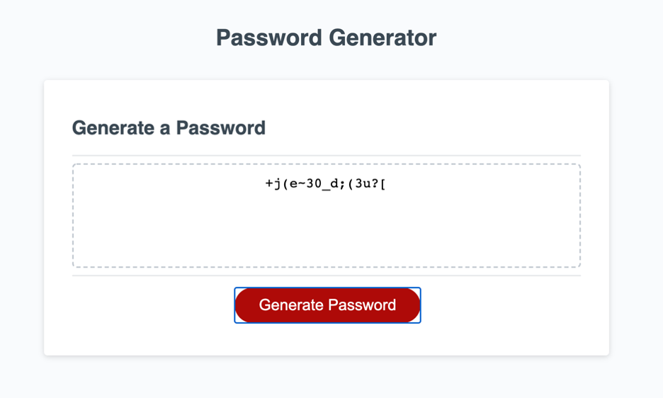

# PasswordGenerator-Strong

## About the Project
Generate a random and secure password using multiple combination types such as: number of characters, lower case letters, upper case, special characters and numbers. 

A valid character amount must be selected. 

Four character style types can be selected by clicking OK, and at least one character type must be selected or you will be prompted to go through the character type loop each time till one is selected.

## Built With

HTML, CSS, JavaScript

## Installation/Get Started

Click link to create your secure password:

https://galacticnative.github.io/PasswordGenerator-Strong/

